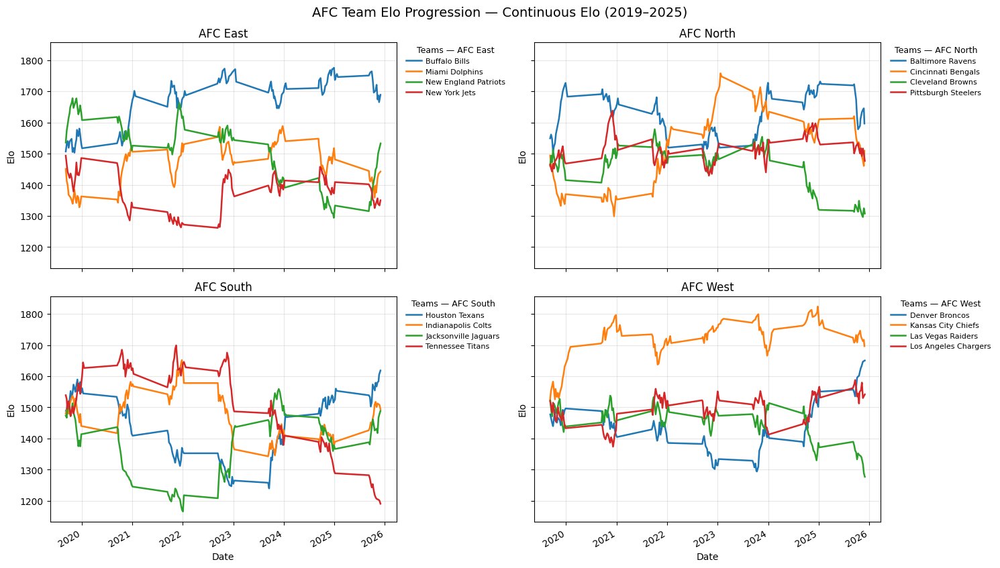
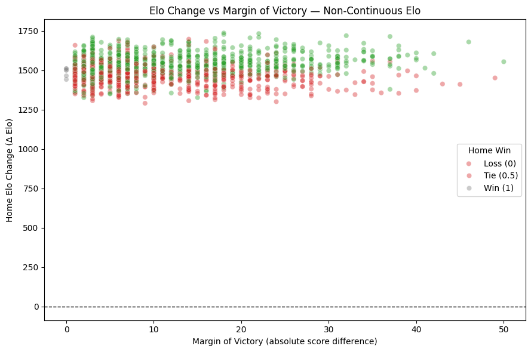
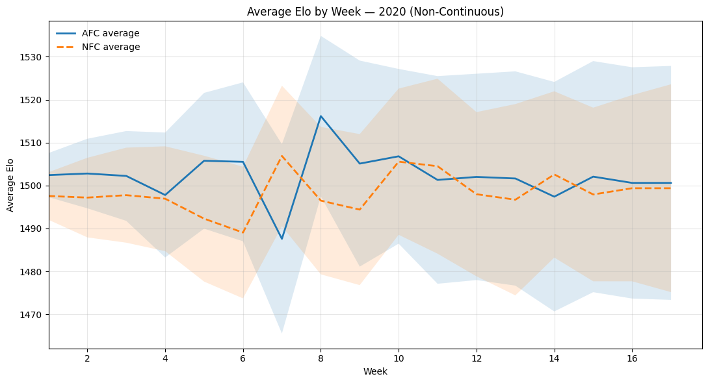
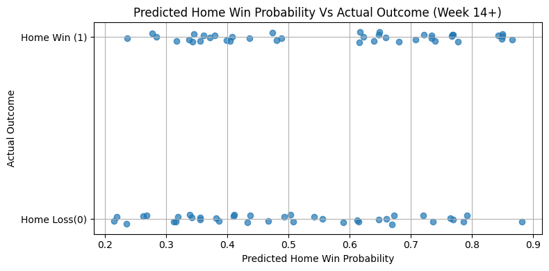
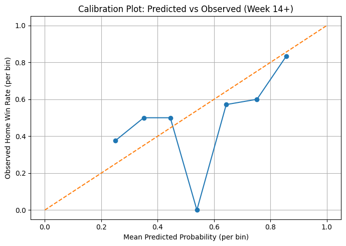
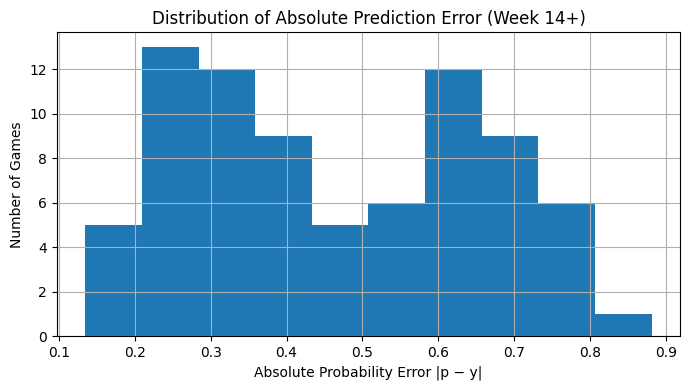

# NFL_HOMEField_Prediction_Model

A probabilistic NFL home-game prediction model combining an enhanced Elo rating system with a Random Forest classifier, including a focused late-season volatility analysis.

---

## Project Overview

This project predicts the probability that a home team wins an NFL game using:

- Continuous and non-continuous Elo ratings  
- Margin-of-victory scaling  
- Team-specific home-field advantage adjustments  
- Rolling performance metrics  
- A Random Forest classifier  

The goal is calibrated probabilistic modeling that reflects both structural signal and real NFL volatility.

---

# 1. Data Pipeline

📁 `NoteBooks/NFL_DATA_PIPELINE.ipynb`

The data pipeline:

- Loads SportsRef `.xls` files (2019–2025)  
- Normalizes historical team names  
- Handles neutral and international games  
- Produces structured game-level datasets  
- Generates future schedule tables for inference  

Processed datasets are stored in 📁 `Reports/`.

---

# 2. Elo Rating System

📁 `NoteBooks/NFL_ELO_MODEL.ipynb`

The foundation of the model is an enhanced Elo framework.

---

## Elo Update Equation

$$
E_{\text{new}} = E_{\text{old}} + K \cdot (\text{Outcome} - \text{Expected})
$$

Where expected win probability is:

$$
\text{Expected} =
\frac{1}{1 + 10^{-\frac{(E_{\text{home}} - E_{\text{away}})}{400}}}
$$

---

## Home-Field Advantage Adjustment

Home-field advantage is added directly to the home team's pre-game Elo:

$$
E_{\text{home, adj}} = E_{\text{home}} + HFA
$$

This allows the model to incorporate structural advantage without assuming it is constant noise.

---

## Margin-of-Victory Scaling

To prevent excessive rating inflation from blowouts, Elo changes are scaled:

$$
\Delta Elo \propto \log(\text{Margin of Victory} + 1)
$$

This keeps updates responsive but bounded.

---

## Elo Visualizations

### AFC Continuous Elo Progression (2019–2025)

### Elo Change vs Margin of Victory

### Average Elo by Week (AFC vs NFC)

These visualizations validate rating stability, margin responsiveness, and inter-conference strength shifts.

---

# 3. Feature Engineering

The final model uses **26 features**, including:

## Elo-Based Features
- Continuous Elo differential  
- Non-continuous Elo differential  
- Expected home win probability  
- Rolling Elo differentials (3-game & 5-game)  

## Momentum & Form
- Rolling margin of victory  
- Win percentage (last 3 / last 5)  
- Season win percentage differential  
- Win/Loss streak differentials  

## Structural Context
- Conference encoding  
- Division encoding  
- Same-conference indicator  
- Same-division indicator  
- Neutral/international flag  

All features are generated using a strict temporal pipeline to prevent data leakage.

---

# 4. Random Forest Model

📁 `NoteBooks/Random_Forest.ipynb`  

Model: `RandomForestClassifier`  
Final model artifact: `final_rf_3.pkl`

---

## Train / Validation / Test Split

- Train: 2019–2023  
- Validation: 2024  
- Test: 2025  

---

## Model Performance (Full 2025 Test Set)

- **ROC-AUC ≈ 0.72**  
- **Brier Score ≈ 0.21**

This indicates strong ranking ability and reasonably calibrated probability estimates across the full season.

---

# 5. Calibration & Reliability (Validation 2023)

### Calibration Curve — RF vs Elo
*(Insert Calibration Curve graph here)*

### Reliability Diagram — RF vs Elo
*(Insert Reliability Diagram graph here)*

The Random Forest improves probability calibration relative to the Elo-only baseline, particularly in mid-probability ranges.

---

# 6. Late-Season Volatility Analysis (Week 14+)

📁 `Analysis/Analysis.ipynb`

Late-season performance:

- Accuracy ≈ 54%  
- ROC-AUC ≈ 0.60  

Late-season games introduce structural variance due to:

- Injury accumulation  
- Playoff qualification incentives  
- Weather impacts  
- Strategic adjustments  

---

## Predicted Probability vs Actual Outcome (Week 14+)

Higher predicted probabilities generally correspond to home wins, confirming directional signal.

---

## Calibration Plot — Week 14+

The 0.5–0.6 probability range notably underperformed.  
This confirms the pattern observed in the scatter plot and suggests that **marginal home advantage was unreliable late in the season**.

---

## Absolute Probability Error Distribution

Most prediction errors are moderate, with fewer extreme high-confidence misses.  
This indicates calibration drift is concentrated in volatile matchups rather than systemic failure.

---

# Key Insights

- The model captures meaningful structural signal in NFL outcomes.  
- Random Forest improves calibration beyond Elo alone.  
- Marginal home advantage becomes unstable late in the season.  
- Late-season volatility reduces reliability of slight edges.  
- Probability estimates remain informative even when binary accuracy declines.  

---

# Interpretation

Late-season NFL games demonstrate increased unpredictability. Even well-structured probabilistic models cannot eliminate randomness in single-game events. This volatility helps explain both unexpected playoff outcomes and the persistence of profitable betting markets.

---

# Repository Structure

